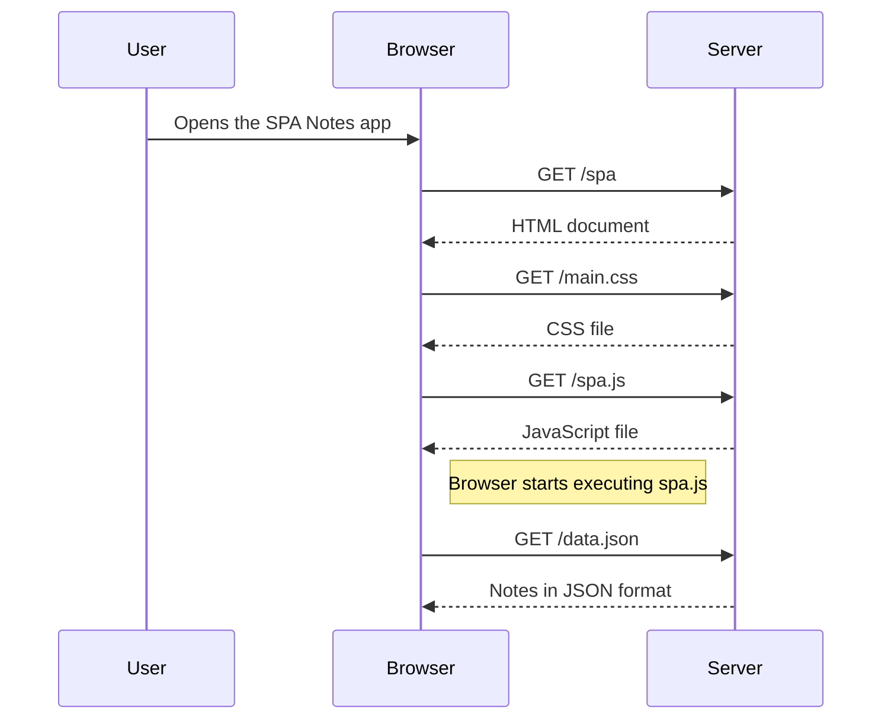

```mermaid
sequenceDiagram
    participant User
    participant Browser
    participant Server

    User->>Browser: Opens the SPA Notes app

    Browser->>Server: GET /spa
    Server-->>Browser: HTML document

    Browser->>Server: GET /main.css
    Server-->>Browser: CSS file

    Browser->>Server: GET /spa.js
    Server-->>Browser: JavaScript file

    Note right of Browser: Browser starts executing spa.js

    Browser->>Server: GET /data.json
    Server-->>Browser: Notes in JSON format
```
